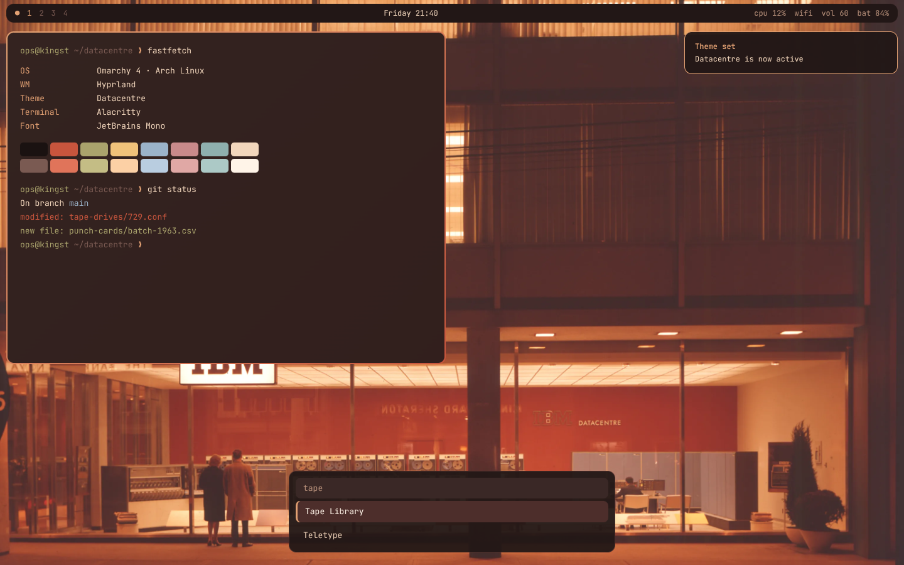

# Datacentre — Omarchy theme

Warm, low-contrast dark theme drawn from a night photo of a 1960s King St. data centre storefront: tobacco-brown facade, sodium-lit blinds, red feature wall, pale-blue cabinets.



## Install

```
omarchy theme install https://github.com/jbettcher-wg/omarchy-datacenter-theme.git
omarchy theme set datacenter
```

Or via the Omarchy menu: Install > Style > Theme, then paste the repo URL.

`omarchy theme install` names the theme after the repository, stripping `omarchy-` and
`-theme`, so this one installs as **datacenter** even though the prose below spells it
the British way.

## Rounded corners

`shell.bar.toml` floats the bar with a 12px radius. Shell surfaces (menus, popups, notifications) follow Hyprland's `decoration:rounding`, so set rounding to 12 in your own Hyprland look-and-feel config.

## Files
- colors.toml — full 24-key palette + gradient window border
- shell.bar.toml — floating rounded bar
- icons.theme — Yaru-wartybrown
- preview.png — theme switcher preview
- backgrounds/01-kingst-datacentre.webp (colour)
- backgrounds/02-kingst-datacentre-1963.webp (1963, black and white) — cycle with `omarchy theme bg next`

## Bar legibility

With a transparent bar, Omarchy samples the wallpaper strip behind the bar and picks whichever
of `bar.text` or `background` has the higher WCAG contrast against it — so over a bright strip
it flips the bar text to the dark colour. The colour photograph's tobacco facade sits exactly
there and measured luminance 0.23, where anything below 0.17 is needed for light text to win;
at 0.23 even pure white (3.74) loses to this theme's `background` (4.38), so no palette change
can fix it.

`01-kingst-datacentre.webp` therefore carries a gradient dimming the top 18%, strongest at the
very top and fading to nothing. The sampled strip lands at luminance 0.14, and light text wins
at every screen size and bar height checked (3840x2160, 2560x1440, 1920x1200, 1920x1440 at bar
28/36/48/64 — worst case 3.98 against 2.96). The 1963 photograph needed nothing: its strip is
already #414141 and light text wins there 7.29 to 1.63.

## Image credits

Both backgrounds are photographs of the IBM Datacentre on King Street, Toronto, the second
dated 1963. They are reproduced apart from format conversion and, on the colour one, a soft gradient
dimming of the top 18% (see "Bar legibility" below), and they are **not
owned by the author of this theme** — all rights remain with the original copyright holder.
These images appear on many sites without consistent attribution and the original source could
not be established; if you are the rights holder, or know who is, please open an issue and it
will be credited or removed.

The theme files themselves (colors.toml, shell.bar.toml, icons.theme) are free to use and modify.
